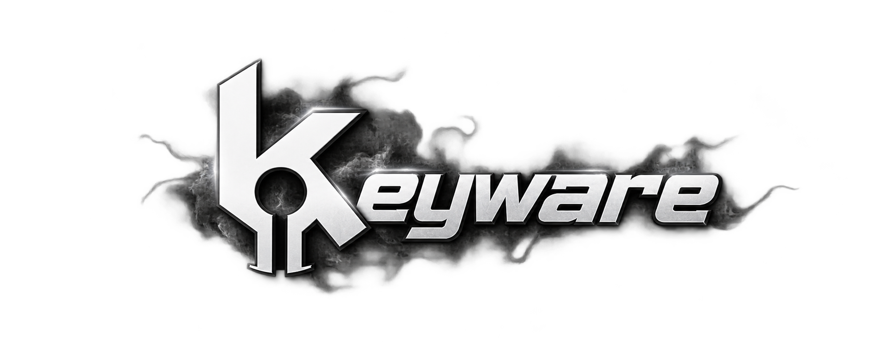

<p align="center">
  
</p>

<p align="center">
  
  
  
  
</p>

<p align="center">
  <b>High-performance, modular Direct Messages extension for BetterDiscord.</b><br>
  <sub>Zero-overhead workspace management, deterministic DOM sorting, audio dispatch interception, soundboard routing, and granular UI shaders.</sub>
</p>

<p align="center">
  <a href="#overview">Overview</a> •
  <a href="#key-modules">Modules</a> •
  <a href="#one-liner-install">Quick Start</a> •
  <a href="#technical-specifications">Specifications</a> •
  <a href="#license">License</a>
</p>

---

### Overview

**KeyWare** replaces standard Discord direct message lists with an organized, extensible workspace system. Designed from the ground up to prevent React unmount cycles, it operates synchronously within Discord's native event pipeline without introducing layout thrashing or background resource leaks.

---

### Key Modules

#### `[01]` Channel Categorization & Sorting Engine
- **Non-Destructive Ordering:** Organizes conversations through native CSS flexbox indexes (`order`), preserving Discord's internal component state and drag-and-drop contexts.
- **Tree State Persistence:** Collapse inactive categories while preserving real-time unread message counts and mention notifications.
- **Dynamic Context Actions:** Right-click any category header for instant renaming, color/shader re-assignment, or channel management.

#### `[02]` Audio Dispatcher & Per-Target Notification Routing
- **Pre-Emptive Audio Interception:** Discord's default notification ping is intercepted synchronously at `Dispatcher.dispatch` before playback begins, guaranteeing only your assigned custom sound executes.
- **Discord Server Soundboard Integration:** Browse, search, preview, and assign soundboard sounds from any server you belong to directly to individual DMs.
- **Granular Sound Binding:** Assign custom local `.mp3` files, soundboard sounds, or direct HTTP audio streams to individual users or group chats.
- **Base64 Inline Decoder:** Native conversion of local files to Base64 data URIs to bypass strict client file protocol restrictions.

#### `[03]` Visual Shaders & Atmospheric Engine
- **Hardware-Accelerated Presets:**
  - `Frosted Glass` (CSS backdrop filter with ambient refraction)
  - `Cyberpunk Neon` (Dual-stop high-contrast magenta/violet gradient)
  - `Thermal Fire` (Warm ember gradient with high-frequency border)
  - `Emerald Breeze` (Cool mint gradient)
  - `Gilded Gold` (Subtle metallic brass shimmer)
- **Particle Rain Engine:** Background particle canvas supporting custom Discord emojis, image links, variable velocity, and density presets.

#### `[04]` Typography & Aesthetic Engine
- **Host OS Font Integration:** Type any font name installed on your Windows system to render immediately with zero network latency.
- **Embedded Web Fonts:** Integrated Google Web Fonts suite including *Orbitron, Poppins, Montserrat, Cinzel, Righteous, Permanent Marker, and Press Start 2P*.
- **Left Indicator Accents:** Customizable left-border status indicators with per-category accent colors.

---

### Technical Specifications

| Parameter | Specification | Description |
| :--- | :--- | :--- |
| **Compatibility** | BetterDiscord v1.0.0+ | Native plugin sandbox API |
| **Pipeline Hook** | `Dispatcher.dispatch` | Synchronous pre-dispatch audio suppression |
| **DOM Target** | `nav[aria-label="Direct Messages"]` | Native list container integration |
| **Storage Engine** | `BdApi.Data` (JSON) | Isolated persistent local storage |
| **Font Pipeline** | Direct CSS `@import` & GDI Local | Zero-latency font mapping |
| **Memory Footprint** | `< 2.5 MB` | Zero background polling timers |

---

### One-Liner Install

#### Windows (PowerShell)
```powershell
iwr "https://raw.githubusercontent.com/keyrexdevelopment/keyware-dms/main/KeyWare.plugin.js" -OutFile "$env:APPDATA\BetterDiscord\plugins\KeyWare.plugin.js"
```

#### Manual Installation
1. Ensure **[BetterDiscord](https://betterdiscord.app/)** is installed.
2. Download [`KeyWare.plugin.js`](https://raw.githubusercontent.com/keyrexdevelopment/keyware-dms/main/KeyWare.plugin.js).
3. Place the file inside your BetterDiscord plugins directory:
   ```
   %appdata%\BetterDiscord\plugins
   ```
4. Open Discord Settings ➔ **Plugins** and enable **KeyWare**.

---

### Automatic Updates

KeyWare utilizes BetterDiscord's native update pipeline. When a new release is pushed to GitHub, an update notification will automatically appear in your Discord client:

```
[ Update Available ] KeyWare v5.8.x ➔ [ Update Now ]
```

---

<p align="center">
  <sub>Distributed under the <b>MIT License</b>. Crafted with precision by <a href="https://github.com/keyrexdevelopment"><b>keyrex</b></a>.</sub>
</p>
